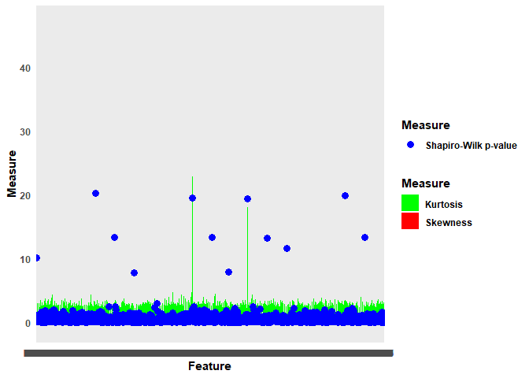

<!-- README.md is generated from README.Rmd. Please edit that file -->

# omicsTools

<!-- badges: start -->

[](https://cran.r-project.org/package=omicsTools)
[](https://lifecycle.r-lib.org/articles/stages.html#experimental)

<!-- badges: end -->

The goal of omicsTools is to provide tools for processing and analyzing
omics data from genomics, transcriptomics, proteomics, and metabolomics
platforms. It provides functions for preprocessing, normalization,
visualization, and statistical analysis, as well as machine learning
algorithms for predictive modeling. omicsTools is an essential tool for
researchers working with high-throughput omics data in fields such as
biology, bioinformatics, and medicine.

License: AGPL-3.0

## Installation

### CRAN version

You can install the Stable version of omicsTools like so:

``` r
install.packages("omicsTools")
```

### Development version

To get a bug fix, or use a feature from the development version, you can
install omicsTools from GitHub.

``` r
if (!require("devtools", quietly = TRUE))
    install.packages("devtools")
devtools::install_github("cheemalab/omicsTools")
```

## Example of imputation

``` r
# Load the CSV data
data_file <- system.file("extdata", "example1.csv", package = "omicsTools")
data <- readr::read_csv(data_file)
#> Rows: 85 Columns: 482
#> ── Column specification ────────────────────────────────────────────────────────
#> Delimiter: ","
#> chr   (1): Sample
#> dbl (414): Urea_pos, Lipoamide_pos, AcetylAmino Sugars_pos, Glycerophosphoch...
#> lgl  (67): DBQ_pos.IS, Aminolevulinic Acid_pos, Leucine_pos, Homocystine_pos...
#> 
#> ℹ Use `spec()` to retrieve the full column specification for this data.
#> ℹ Specify the column types or set `show_col_types = FALSE` to quiet this message.
```

``` r
# Apply the impute function
imputed_data <- omicsTools::handle_missing_values(data)
#> ℹ Starting missing value handling... 🚀
#> ℹ Calculating missing value percentages... ⏳
#> ✔ 446 features removed due to missing values exceeding the threshold. ✅
#> ℹ Imputing missing values using method: mean 🔧
#> ✔ Missing value handling completed! 🎉
```

``` r
# Write the imputed data to a new CSV file
readr::write_csv(imputed_data, paste0(tempdir(), "/imputed_data.csv"))
```

## Example of QC-normalization

``` r
# Load the CSV data
data_file <- system.file("extdata", "example2.csv", package = "omicsTools")
data <- readr::read_csv(data_file)
#> Rows: 63 Columns: 202
#> ── Column specification ────────────────────────────────────────────────────────
#> Delimiter: ","
#> chr   (1): Sample
#> dbl (201): Urea_pos, Lipoamide_pos, Glycerophosphocholine_pos, Allanoate_pos...
#> 
#> ℹ Use `spec()` to retrieve the full column specification for this data.
#> ℹ Specify the column types or set `show_col_types = FALSE` to quiet this message.
```

``` r
# Apply the normalize function
normalized_data <- omicsTools::qc_normalize(data)
# Write the normalized data to a new CSV file
readr::write_csv(normalized_data, paste0(tempdir(), "/normalized_data.csv"))
```

## Anomaly removal Example 1: Using generated data

``` r
# Using generated data
library(omicsTools)
#> 
#> This is omicsTools version 1.1.2.
#> omicsTools is free software and comes with ABSOLUTELY NO WARRANTY.
#> Please use at your own risk.
```

``` r
omics_data <- createOmicsData()
#> 
#> ── Generating High-Dimensional Data with Anomalies ─────────────────────────────
#> ℹ Introducing anomalies in specific features
#> ✔ Data generation complete
```

``` r

# Define custom thresholds
custom_thresholds <- define_thresholds(skewness = 3, kurtosis = 8)

# Update the OmicsData object with custom thresholds
omics_data@thresholds <- custom_thresholds

# Calculate measures for each feature
omics_data <- calculate_measures(omics_data)
#> 
#> ── Calculating Measures for Each Feature ───────────────────────────────────────
#> Calculating [===>------------------------------------------------]   7% in  0sCalculating [===>------------------------------------------------]   8% in  0sCalculating [===>------------------------------------------------]   9% in  0sCalculating [====>-----------------------------------------------]   9% in  0sCalculating [====>-----------------------------------------------]  10% in  0sCalculating [====>-----------------------------------------------]  11% in  0sCalculating [=====>----------------------------------------------]  11% in  0sCalculating [=====>----------------------------------------------]  12% in  0sCalculating [======>---------------------------------------------]  13% in  0sCalculating [======>---------------------------------------------]  14% in  0sCalculating [=======>--------------------------------------------]  14% in  0sCalculating [=======>--------------------------------------------]  15% in  0sCalculating [=======>--------------------------------------------]  16% in  0sCalculating [========>-------------------------------------------]  16% in  0sCalculating [========>-------------------------------------------]  17% in  0sCalculating [========>-------------------------------------------]  18% in  0sCalculating [=========>------------------------------------------]  18% in  0sCalculating [=========>------------------------------------------]  19% in  0sCalculating [=========>------------------------------------------]  19% in  1sCalculating [=========>------------------------------------------]  20% in  1sCalculating [==========>-----------------------------------------]  20% in  1sCalculating [==========>-----------------------------------------]  21% in  1sCalculating [==========>-----------------------------------------]  22% in  1sCalculating [===========>----------------------------------------]  22% in  1sCalculating [===========>----------------------------------------]  23% in  1sCalculating [===========>----------------------------------------]  24% in  1sCalculating [============>---------------------------------------]  24% in  1sCalculating [============>---------------------------------------]  25% in  1sCalculating [============>---------------------------------------]  26% in  1sCalculating [=============>--------------------------------------]  26% in  1sCalculating [=============>--------------------------------------]  27% in  1sCalculating [=============>--------------------------------------]  28% in  1sCalculating [==============>-------------------------------------]  28% in  1sCalculating [==============>-------------------------------------]  29% in  1sCalculating [==============>-------------------------------------]  30% in  1sCalculating [===============>------------------------------------]  30% in  1sCalculating [===============>------------------------------------]  31% in  1sCalculating [===============>------------------------------------]  32% in  1sCalculating [================>-----------------------------------]  32% in  1sCalculating [================>-----------------------------------]  33% in  1sCalculating [================>-----------------------------------]  34% in  1sCalculating [=================>----------------------------------]  34% in  1sCalculating [=================>----------------------------------]  35% in  1sCalculating [=================>----------------------------------]  36% in  1sCalculating [==================>---------------------------------]  36% in  1sCalculating [==================>---------------------------------]  37% in  1sCalculating [===================>--------------------------------]  38% in  1sCalculating [===================>--------------------------------]  39% in  1sCalculating [====================>-------------------------------]  39% in  1sCalculating [====================>-------------------------------]  40% in  1sCalculating [====================>-------------------------------]  41% in  1sCalculating [=====================>------------------------------]  41% in  1sCalculating [=====================>------------------------------]  42% in  1sCalculating [=====================>------------------------------]  43% in  1sCalculating [======================>-----------------------------]  43% in  1sCalculating [======================>-----------------------------]  44% in  1sCalculating [======================>-----------------------------]  45% in  1sCalculating [=======================>----------------------------]  45% in  1sCalculating [=======================>----------------------------]  46% in  1sCalculating [=======================>----------------------------]  47% in  1sCalculating [========================>---------------------------]  47% in  1sCalculating [========================>---------------------------]  48% in  1sCalculating [========================>---------------------------]  49% in  1sCalculating [=========================>--------------------------]  49% in  1sCalculating [=========================>--------------------------]  50% in  1sCalculating [=========================>--------------------------]  51% in  1sCalculating [==========================>-------------------------]  51% in  1sCalculating [==========================>-------------------------]  52% in  1sCalculating [==========================>-------------------------]  53% in  1sCalculating [===========================>------------------------]  53% in  1sCalculating [===========================>------------------------]  54% in  1sCalculating [===========================>------------------------]  55% in  1sCalculating [============================>-----------------------]  55% in  1sCalculating [============================>-----------------------]  56% in  1sCalculating [============================>-----------------------]  57% in  1sCalculating [=============================>----------------------]  57% in  1sCalculating [=============================>----------------------]  58% in  1sCalculating [=============================>----------------------]  59% in  1sCalculating [==============================>---------------------]  59% in  1sCalculating [==============================>---------------------]  60% in  1sCalculating [==============================>---------------------]  61% in  1sCalculating [===============================>--------------------]  61% in  1sCalculating [===============================>--------------------]  62% in  1sCalculating [===============================>--------------------]  62% in  2sCalculating [================================>-------------------]  63% in  2sCalculating [================================>-------------------]  64% in  2sCalculating [=================================>------------------]  64% in  2sCalculating [=================================>------------------]  65% in  2sCalculating [=================================>------------------]  66% in  2sCalculating [==================================>-----------------]  66% in  2sCalculating [==================================>-----------------]  67% in  2sCalculating [==================================>-----------------]  68% in  2sCalculating [===================================>----------------]  68% in  2sCalculating [===================================>----------------]  69% in  2sCalculating [===================================>----------------]  70% in  2sCalculating [====================================>---------------]  70% in  2sCalculating [====================================>---------------]  71% in  2sCalculating [====================================>---------------]  72% in  2sCalculating [=====================================>--------------]  72% in  2sCalculating [=====================================>--------------]  73% in  2sCalculating [=====================================>--------------]  74% in  2sCalculating [======================================>-------------]  74% in  2sCalculating [======================================>-------------]  75% in  2sCalculating [======================================>-------------]  76% in  2sCalculating [=======================================>------------]  76% in  2sCalculating [=======================================>------------]  77% in  2sCalculating [=======================================>------------]  78% in  2sCalculating [========================================>-----------]  78% in  2sCalculating [========================================>-----------]  79% in  2sCalculating [========================================>-----------]  80% in  2sCalculating [=========================================>----------]  80% in  2sCalculating [=========================================>----------]  81% in  2sCalculating [=========================================>----------]  82% in  2sCalculating [==========================================>---------]  82% in  2sCalculating [==========================================>---------]  83% in  2sCalculating [==========================================>---------]  84% in  2sCalculating [===========================================>--------]  84% in  2sCalculating [===========================================>--------]  85% in  2sCalculating [===========================================>--------]  86% in  2sCalculating [============================================>-------]  86% in  2sCalculating [============================================>-------]  87% in  2sCalculating [=============================================>------]  88% in  2sCalculating [=============================================>------]  89% in  2sCalculating [==============================================>-----]  89% in  2sCalculating [==============================================>-----]  90% in  2sCalculating [==============================================>-----]  91% in  2sCalculating [===============================================>----]  91% in  2sCalculating [===============================================>----]  92% in  2sCalculating [===============================================>----]  93% in  2sCalculating [================================================>---]  93% in  2sCalculating [================================================>---]  94% in  2sCalculating [================================================>---]  95% in  2sCalculating [=================================================>--]  95% in  2sCalculating [=================================================>--]  96% in  2sCalculating [=================================================>--]  97% in  2sCalculating [==================================================>-]  97% in  2sCalculating [==================================================>-]  98% in  2sCalculating [==================================================>-]  99% in  2sCalculating [===================================================>]  99% in  2sCalculating [===================================================>] 100% in  2sCalculating [====================================================] 100% in  2s
#> ✔ Measures calculation complete
```

``` r

# Flag anomalies
omics_data <- flag_anomalies(omics_data)
#> 
#> ── Flagging Anomalies ──────────────────────────────────────────────────────────
#> ✔ Anomaly flagging complete
```

``` r

# Plotting distribution measures
plot_distribution_measures(omics_data)
#> 
#> ── Plotting Distribution Measures ──────────────────────────────────────────────
#> ✔ Distribution measures plot complete
```



``` r

# Plotting sample measures
plot_sample_measures(omics_data)
#> 
#> ── Plotting Sample Measures ────────────────────────────────────────────────────
#> ✔ Sample measures plot complete
```


``` r

# Prepare data for UpSet plot
upset_data <- prepare_upset_data(omics_data)
#> 
#> ── Preparing Data for UpSet Plot ───────────────────────────────────────────────
#> ✔ Data preparation for UpSet plot complete
```

``` r

# Convert to binary matrix for UpSetR
upset_matrix <- convert_to_binary_matrix(upset_data)
#> 
#> ── Converting Data to Binary Matrix for UpSetR ─────────────────────────────────
#> ✔ Data conversion to binary matrix complete
```

``` r

# Ensure there are at least two columns for the UpSet plot
ensure_enough_sets_for_upset(upset_matrix)
#> 
#> ── Checking Data for UpSet Plot ────────────────────────────────────────────────
#> ✔ Enough sets for UpSet plot
```


# Anomaly removal Example 2: Using user-provided data

``` r

library(omicsTools)

# Assuming user_data is a data frame where rows are samples and columns are features
user_data <- generate_data_with_anomalies(n_samples = 100, n_features = 200)  # Replace with actual data loading if available
#> 
#> ── Generating High-Dimensional Data with Anomalies ─────────────────────────────
#> ℹ Introducing anomalies in specific features
#> ✔ Data generation complete
```

``` r
omics_data_user <- createOmicsData(data = user_data)

# Define custom thresholds
custom_thresholds_user <- define_thresholds(skewness = 4, kurtosis = 6, shapiro_p = 1e-5, cooks_distance = 0.5, lof = 10)

# Update the OmicsData object with custom thresholds
omics_data_user@thresholds <- custom_thresholds_user

# Calculate measures for each feature
omics_data_user <- calculate_measures(omics_data_user)
#> 
#> ── Calculating Measures for Each Feature ───────────────────────────────────────
#> ✔ Measures calculation complete
```

``` r

# Flag anomalies
omics_data_user <- flag_anomalies(omics_data_user)
#> 
#> ── Flagging Anomalies ──────────────────────────────────────────────────────────
#> ✔ Anomaly flagging complete
```

``` r

# Plotting distribution measures
plot_distribution_measures(omics_data_user)
#> 
#> ── Plotting Distribution Measures ──────────────────────────────────────────────
#> ✔ Distribution measures plot complete
```


``` r

# Plotting sample measures
plot_sample_measures(omics_data_user)
#> 
#> ── Plotting Sample Measures ────────────────────────────────────────────────────
#> ✔ Sample measures plot complete
```


``` r

# Prepare data for UpSet plot
upset_data_user <- prepare_upset_data(omics_data_user)
#> 
#> ── Preparing Data for UpSet Plot ───────────────────────────────────────────────
#> ✔ Data preparation for UpSet plot complete
```

``` r

# Convert to binary matrix for UpSetR
upset_matrix_user <- convert_to_binary_matrix(upset_data_user)
#> 
#> ── Converting Data to Binary Matrix for UpSetR ─────────────────────────────────
#> ✔ Data conversion to binary matrix complete
```

``` r

# Ensure there are at least two columns for the UpSet plot
ensure_enough_sets_for_upset(upset_matrix_user)
#> 
#> ── Checking Data for UpSet Plot ────────────────────────────────────────────────
#> ✔ Enough sets for UpSet plot
```


### Code style

Since this is a collaborative project, please adhere to the following
code formatting conventions: \* We use the tidyverse style guide
(<https://style.tidyverse.org/>) \* Please write roxygen2 comments as
full sentences, starting with a capital letter and ending with a period.
Brevity is preferred (e.g., “Calculates standard deviation” is preferred
over “This method calculates and returns a standard deviation of given
set of numbers”).
